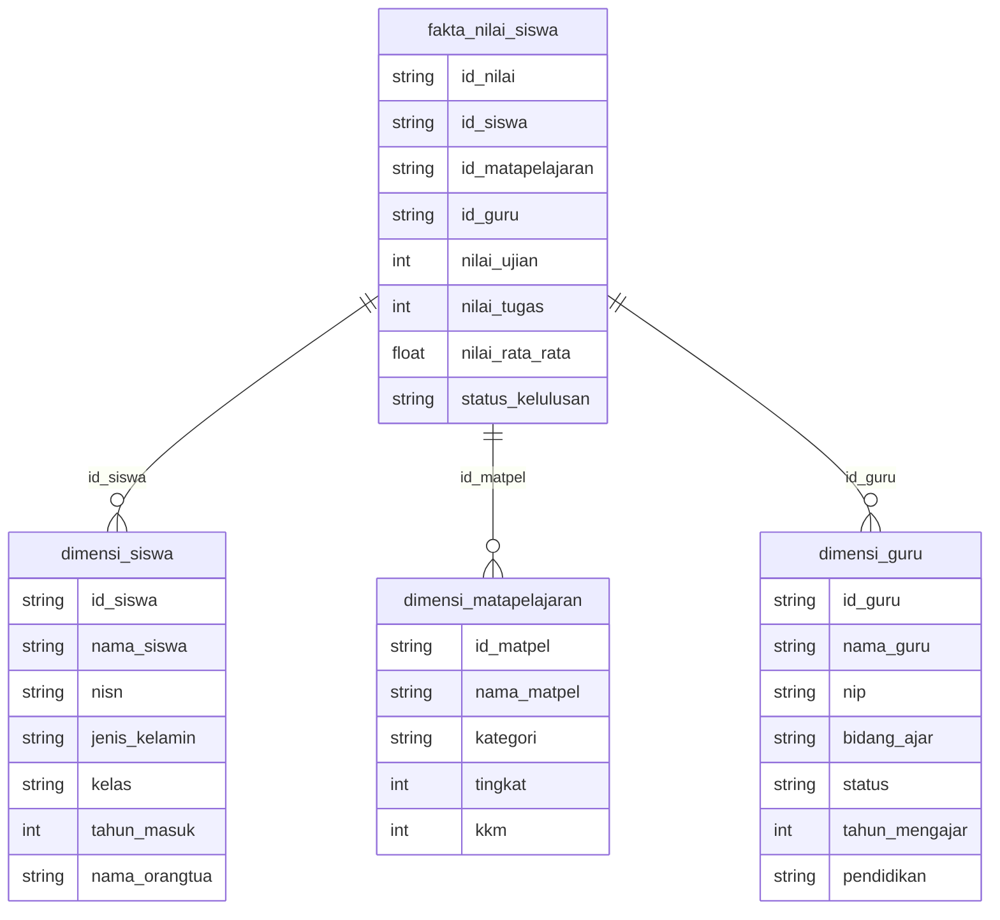
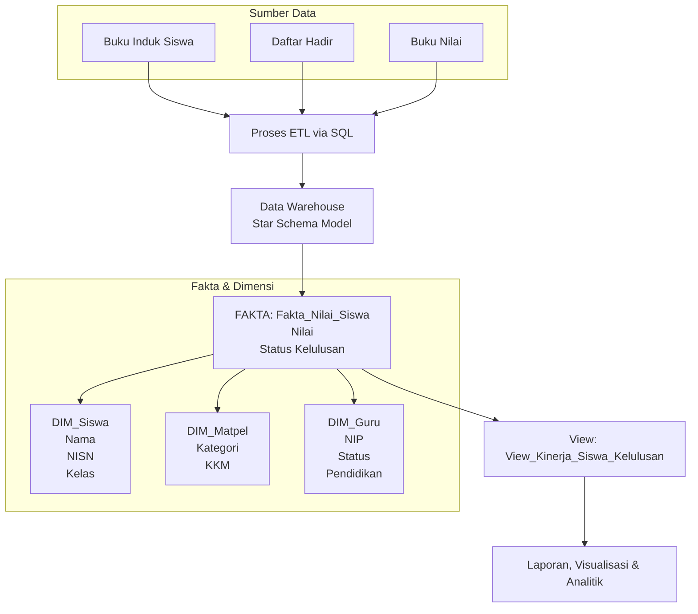

# 🏫💡 Data Warehouse Sekolah Dasar Bombardilo Crocodilo

Repositori ini berisi proyek pembangunan sistem **Data Warehouse (DW)** untuk mendukung pengelolaan data akademik dan administrasi di **Sekolah Dasar Bombardilo Crocodilo**.

🛠️ Dibuat oleh: **Kelompok 9 - RA**  
🎓 Program Studi Sains Data, ITERA  
📅 Tahun: 2025

---

## 1. 🔎 Ringkasan Proyek dan Latar Belakang

Pengelolaan data di sekolah masih bergantung pada catatan manual dan spreadsheet terpisah. Ini menyulitkan pelaporan ke Dinas Pendidikan serta pemantauan kinerja siswa.  
Melalui sistem Data Warehouse, informasi penting seperti nilai, kehadiran, dan profil siswa akan terintegrasi dan siap dianalisis menggunakan tools visualisasi dan query SQL.

---

## 2. 🎯 Tujuan dan Ruang Lingkup Sistem

**Tujuan:**
- Mengintegrasikan data dari berbagai sumber menjadi satu sistem DW.
- Menyediakan sistem pelaporan dan analisis akademik.
- Meningkatkan efisiensi pelaporan dan pemantauan.

**Ruang Lingkup:**
- Nilai akademik siswa
- Informasi guru & mata pelajaran
- Kehadiran & status kelulusan

---

## 3. 🧰 Metodologi

### Pendekatan:
Model **Waterfall** dengan tahapan:
1. Misi 1 – Analisis kebutuhan dan stakeholder
2. Misi 2 – Desain konseptual (Star Schema)
3. Misi 3 – Desain logikal & fisikal, proses ETL
4. Misi 4 – Implementasi & evaluasi

### Tools:
- SQL (MySQL/PostgreSQL)
- Python (ETL dengan Pandas)
- Excel/CSV
- BI Tools (Power BI / Excel)

---

## 4. 📋 Analisis Kebutuhan (Misi 1)

**Stakeholder:**
- Kepala Sekolah
- Kurikulum
- Administrasi
- Kesiswaan
- Dinas Pendidikan

**Kebutuhan:**
- Pelacakan nilai siswa per semester.
- Pemantauan kehadiran dan kegiatan siswa.
- Laporan untuk pihak eksternal.

---

## 5. 🧩 Desain Konseptual, Logikal, dan Fisik

### 🌟 Star Schema



---

## 6. 🏗️ Arsitektur Sistem



---

## 7. ⚙️ Proses Implementasi

### Contoh Query SQL:

```sql
CREATE TABLE Dimensi_Siswa (
  ID_Siswa VARCHAR(10) PRIMARY KEY,
  Nama_Siswa VARCHAR(100),
  NISN VARCHAR(20),
  Jenis_Kelamin CHAR(1),
  Kelas VARCHAR(10),
  Tahun_Masuk INT,
  Nama_Orangtua VARCHAR(100)
);

CREATE TABLE Fakta_Nilai_Siswa (
  ID_Nilai VARCHAR(10) PRIMARY KEY,
  ID_Siswa VARCHAR(10),
  ID_MataPelajaran VARCHAR(10),
  ID_Guru VARCHAR(10),
  Nilai_Ujian INT,
  Nilai_Tugas INT,
  Nilai_Rata_Rata DECIMAL(5,2),
  Status_Kelulusan VARCHAR(20),
  FOREIGN KEY (ID_Siswa) REFERENCES Dimensi_Siswa(ID_Siswa)
);
```

### Proses ETL:

- **Extract**: Ambil data dari file Excel (Buku Induk, Absensi, Nilai)
- **Transform**: Bersihkan data, hitung nilai rata-rata, validasi status
- **Load**: Muat ke dalam tabel di SQL DBMS

📂 Dataset: [bit.ly/DatasetSQL_DW_Kel9_RA](https://bit.ly/DatasetSQL_DW_Kel9_RA)

---

## 8. ✅ Hasil Implementasi

- Query agregasi berhasil menampilkan rata-rata per status kelulusan
- View berhasil menampilkan ringkasan siswa lulus dan tidak lulus
- Struktur data terhubung antar dimensi dengan baik

---

## 9. 📉 Evaluasi

**Berhasil:**
- Star Schema & ETL dapat berjalan dengan dummy data
- Efisiensi query meningkat dengan indexing & partisi

**Kendala:**
- Data real belum digunakan
- Visualisasi dashboard belum terimplementasi

---

## 10. 🔮 Rencana Pengembangan

- Tambahan fitur autentikasi pengguna (admin, guru, kepala sekolah)
- Integrasi dashboard interaktif dengan Power BI / Streamlit
- Penambahan fakta baru: kehadiran siswa, pelanggaran, kegiatan

---

## 11. 👥 Tim Proyek

**Kelompok 9 - RA**  
📍 Program Studi Sains Data, ITERA

| Nama                          | NIM         | Peran       |
|-------------------------------|-------------|-------------|
| Dhea Amelia Putri             | 122450004   | Anggota     |
| Marleta Cornelia Leander     | 122450092   | Anggota     |
| Berliyana Kesuma Hati        | 121450086   | Anggota     |
| Najla Juwairia               | 122450037   | Anggota     |
| **Nurul Alfajar Gumel** ⭐    | 122450127   | Ketua Tim   |
| Tarisah                      | 121450141   | Anggota     |

---

_“Data bukan hanya angka. Ia adalah cerminan kualitas pendidikan.”_

Terima kasih telah membaca! 🎓📈
